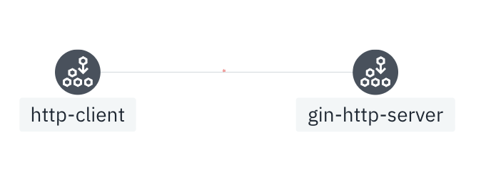
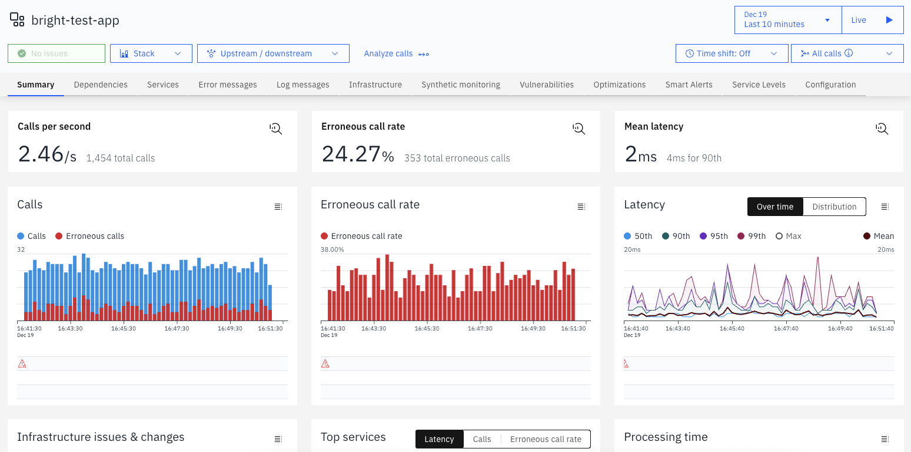
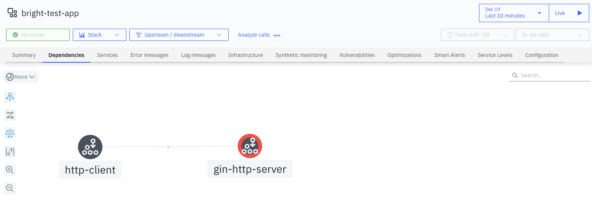
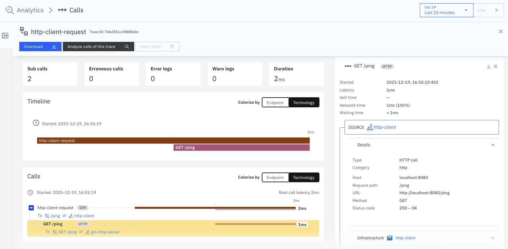
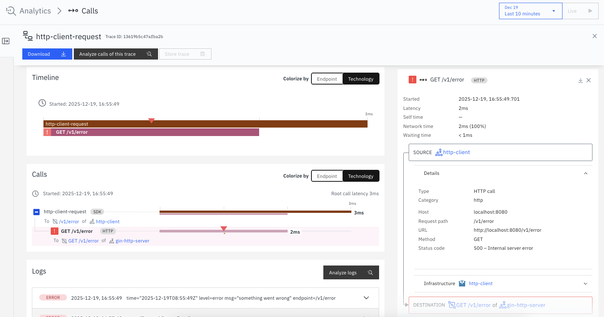

# A simple `gin` based Golang app

An example of instrumenting a `github.com/gin-gonic/gin` HTTP service with Instana using its [`go-sensor`](https://github.com/instana/go-sensor).

Copied from [`https://github.com/instana/go-sensor/tree/main/example/gin`](https://github.com/instana/go-sensor/tree/main/example/gin) with some extra changes to make it a client -> server architecture to illustrate the instrumentation on both client and server sides.



There are two folders in this repo:

- `original` is the folder hosting a simple native `gin` app.
- `with-sdk` is the folder hosting the instrumented above app, with Instana Golang SDK.

## Build

Build the original app:

```sh
cd original
./build.sh
```

The binary files will be appeared in `bin` folder.


Similarly, to build the instrumented app:

```sh
cd with-sdk
./build.sh
```

The binary files will be appeared in `bin` folder.


## Usage

### From source

**1. Server:**

```bash
go run server.go
```

It defaults to listen on port `8080`.

In case when the port is already in use, please specify it by `-l` parameter.

```sh
go run server.go -l ":8081"
```

You will see outputs like:

```log
...
[GIN-debug] GET    /ping                     --> main.main.func1 (3 handlers)
[GIN-debug] GET    /v1/ping                  --> main.main.func2 (3 handlers)
[GIN-debug] GET    /v1/error                 --> main.main.func3 (3 handlers)
...
[GIN-debug] Listening and serving HTTP on :8080
```

Feel free to ignore those scary warnings since this is a simple demo app.

**2. Client:**

You may open another console to run the client.

```sh
go run client/client.go
```

If the server listens to non-default port, say at `http://localhost:8081`, specify it by `-s` parameter:

```sh
go run client/client.go -s http://localhost:8081
```


### From binnary

I intentionally keep the compiled binary files in the repo as well, just for your convenience.

For example, if you're with a MacBook in Mx CPU:

**1. Server:**

```sh
./bin/gin-server-darwin-arm64
```

It defaults to listen on port `8080`.

In case when the port is already in use, please specify it by `-l` parameter.

```sh
./bin/gin-server-darwin-arm64 -l ":8081"
```

You will see outputs like:

```log
...
[GIN-debug] GET    /ping                     --> main.main.func1 (3 handlers)
[GIN-debug] GET    /v1/ping                  --> main.main.func2 (3 handlers)
[GIN-debug] GET    /v1/error                 --> main.main.func3 (3 handlers)
...
[GIN-debug] Listening and serving HTTP on :8080
```

Feel free to ignore those scary warnings since this is a simple demo app.


**2. Client:**

You may open another console to run the client.

For example, if you're with a MacBook in Mx CPU:

```sh
./bin/gin-client-darwin-arm64
```

If the server listens to non-default port, say at `http://localhost:8081`, specify it by `-s` parameter:

```sh
./bin/gin-client-darwin-arm64 -s http://localhost:8081
```

## Some Findings

### Dashboard & Golden Signals

As usual:



### Discovery & Dependency Map

Both Client and Server are automatically discovered properly:



### Tracing

Tracing without error:



Tracing with error(s):
- The overall trace is properly marked as `error`.
- The ERROR level logs are properly ingested to further enhance the tracing context.




### Agent Logs

Once the Golang app starts, the agent is able to detect and performs the necessary.

Logs right after Server starts:

```log
2025-12-19T08:35:56.516+00:00 | INFO  | f11-3b65-41ef-899a-41d6eb2876a2) | Golang           | com.instana.sensor-golang - 1.3.8 | Activated Sensor
2025-12-19T08:35:56.518+00:00 | INFO  | dc6-8c16-4f8e-a5b7-3df7ba4b5ec8) | Process          | com.instana.sensor-process - 1.1.55 | Activated Sensor for PID 14970
2025-12-19T08:35:56.519+00:00 | INFO  | b74-ad5e-44b1-82f7-6d7c001943ca) | GolangTrace      | com.instana.sensor-golang-trace - 1.2.1 | Activated Sensor
2025-12-19T08:35:56.520+00:00 | INFO  | 81b-d8e4-41fb-a14c-af30d5cf08b0) | GolangProfile    | com.instana.sensor-golang-profile - 1.0.0 | Activated Sensor
2025-12-19T08:35:57.513+00:00 | INFO  | instana-socket-worker-7-3        | Golang           | com.instana.sensor-golang - 1.3.8 | Detected Go runtime: 1.25.5
```

Further logs right after Client starts:

```log
2025-12-19T08:36:48.076+00:00 | INFO  | 323-2bc9-444b-b299-81a39205e698) | Golang           | com.instana.sensor-golang - 1.3.8 | Activated Sensor
2025-12-19T08:36:48.079+00:00 | INFO  | b48-e830-4d2e-8caa-d4ec728894f8) | Process          | com.instana.sensor-process - 1.1.55 | Activated Sensor for PID 14983
2025-12-19T08:36:48.081+00:00 | INFO  | 8bb-563b-43b6-b870-79b110f348bd) | GolangTrace      | com.instana.sensor-golang-trace - 1.2.1 | Activated Sensor
2025-12-19T08:36:48.082+00:00 | INFO  | 38e-08dd-4605-a6c8-6f0530a0a4ef) | GolangProfile    | com.instana.sensor-golang-profile - 1.0.0 | Activated Sensor
2025-12-19T08:37:09.076+00:00 | INFO  | instana-socket-worker-7-4        | Golang           | com.instana.sensor-golang - 1.3.8 | Detected Go runtime: 1.25.5
```